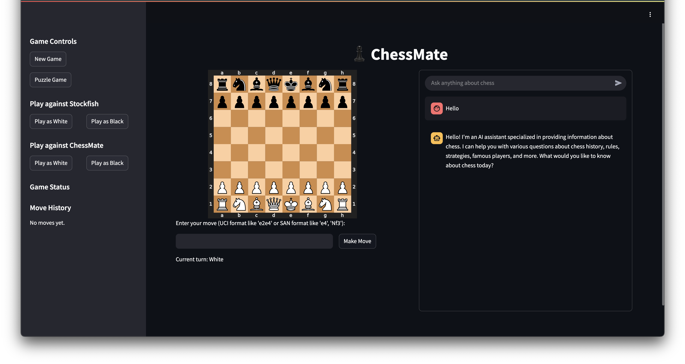

# ChessMate
Brian Kwon & Corwin Dark

## Project Overview
ChessMate is built as a Streamlit web application, which allows users to play Chess against both an LLM and a traditional chess engine (Stockfish). In addition to moves on the board, the application features a text interface which can be used for: RAG over a database of 500,000 grandmaster moves to look for similar situations, get move suggestions from a foundation model fine tuned on grandmaster games, review thousands of articles from chess.com on basic chess principles, and search Google and Wikipedia up-to-date information on chess topics.



## Preparation
To run the application, you will need to set up a few things:
1. **Python Environment**: The application is built using Python 3.10. You can create a virtual environment using `uv'.
2. **Stockfish**: You will need to download the Stockfish chess engine and place it in the `Stockfish` directory.       
3. **Pinecone Vectorstore**: You will need a Pinecone vectorstore for the gameplay agent. Please refer to Brian for more information. Or you can download the FAISS vectorstore version on [Google Drive](https://drive.google.com/drive/folders/1KWKD4RxibcvFrW080SZZxVRxUO306k0k?usp=sharing).

## Usage
You can create a specific python environment via uv using following commands.

```{bash}
curl -LsSf https://astral.sh/uv/install.sh | sh
export PATH="$HOME/.local/bin:$PATH"
uv venv && source .venv/bin/activate && uv pip install --requirement pyproject.toml
```

Then, run the following command to open the application.

```{bash}
streamlit run chess_mate.py
```

## Structure

🚫 - Part of .gitignore and/or not included in the repo
```
.
├── 📁 data
├── 📁 database/knowledge_base       ---> FAISS Vectorstore for chess.com articles
├── 📁 notebooks
├── 📁 Stockfish (🚫)
├── 📁 src                           ---> Our agents
│   ├── tutorial_agent.py
│   ├── multi_agent_supervisor.py
│   ├── puzzle_agent.py
│   └── gameplay_agent.py
├── .env (🚫)
├── .gitignore
├── bedrock_setup.py 
├── chess_mate.py                    ---> ChessMate Streamlit app
├── pyproject.toml
├── uv.lock
└── README.md                                            
```


